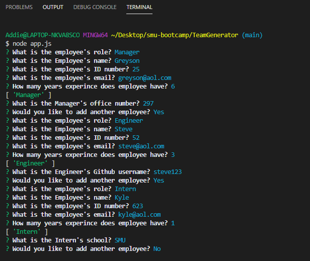
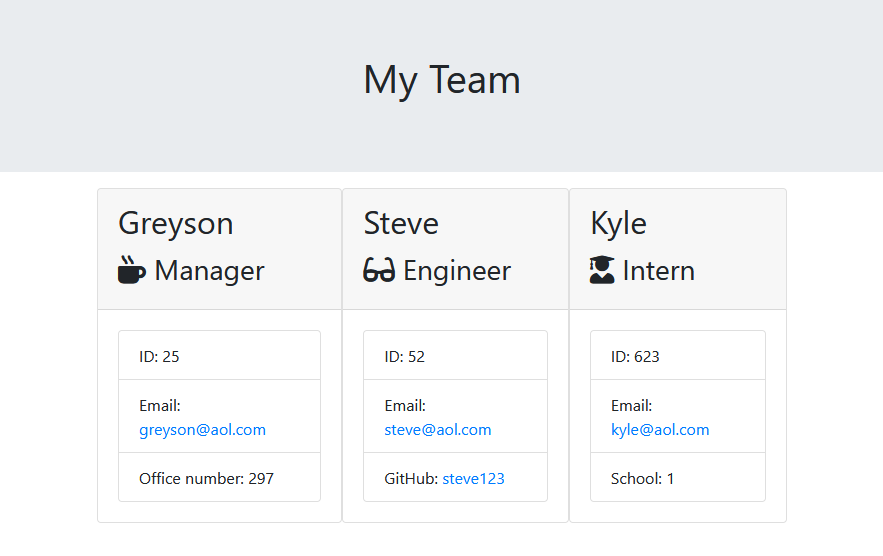

# Team Generator Template

- GitHub Repository: https://github.com/greysonkirk/TeamGenerator
- GitHub CLI Demo: https://greysonkirk.github.io/TeamGenerator/

The purpose of this CLI is to easily build a web page with the team members displayed.  
The user will start the CLI by typing "node app.js" in the termianl.  
The user will then be asked questions about the employee being added to the team. 
After the first 5 questions, the user is asked another question based on the employees role.  
Finally they will be asked if they want to add another employee. 

After the user has finished entering employees, a html file is generated and placed in the output folder. 

